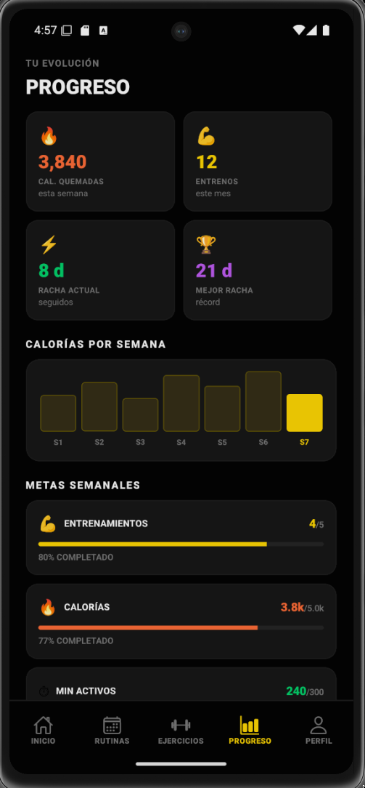

# Mind & Body Mobile

<br>

<!-- Screenshot -->
<p align="center">
  
</p>

<br>

## About

This is the mobile application for Mind & Body, a platform for gym members to train, view their routines, track their progress, and manage their workouts...

## Requirements

- [Node.js](https://nodejs.org/) >= 18
- [pnpm](https://pnpm.io/) or [yarn](https://yarnpkg.com/) (imagine using npm in big 2026)
- [Expo Go](https://expo.dev/go) on your device, or an Android/iOS emulator

## Installation

```bash
pnpm install
```

## Usage

```bash
# Start the development server
pnpm start

# Android
pnpm run android

# iOS
pnpm run ios

# Web
pnpm run web
```

Scan the QR code with Expo Go to open the app on your device.

## Stack

- [Expo](https://expo.dev) ~55
- [React Native](https://reactnative.dev) 0.83
- [React](https://react.dev) 19
- [Expo Router](https://expo.github.io/router)
